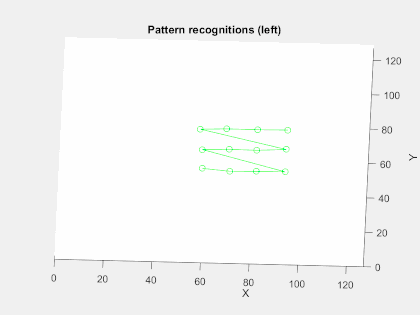

# Documentation / Report

Part of this project was contributed within the scope of a practical course at the TUM NST. This document is the final project report.

The following sections will give a precise overview of the project goal, problems and insights which we gained while developing a solution.

## Table of Contents
<!-- generated with ./scripts/gen_toc.rb -->
  * [Project Goal](#project-goal)
    * [What is an eDVS?](#what-is-an-edvs?)
  * [Software Setup](#software-setup)
    * [Existing Software as Starting Point](#existing-software-as-starting-point)
    * [eDVS Driver for ROS](#edvs-driver-for-ros)
  * [Calibration Walkthrough](#calibration-walkthrough)
    * [Using the calibration data](#using-the-calibration-data)
    * [Calibration Tweaks](#calibration-tweaks)
  * [Results](#results)
    * [Intrinsic and Extrinsic Camera Parameters](#intrinsic-and-extrinsic-camera-parameters)
    * [Benchmark Idea](#benchmark-idea)
    * [Learnings](#learnings)
  * [Ideas for Future Improvements](#ideas-for-future-improvements)
    * [Improvements to eDVS Ros Driver](#improvements-to-edvs-ros-driver)
    * [Buffering of Events](#buffering-of-events)

## Project Goal

In order to extract depth information from a camera stereo setup, most methods need some information about their positioning towards each other. The geometrical and intrinsic camera parameters as well as the rectification matrix are necessary. The project research is to develop a method, how to extract the parameters form a vision stream of a stereo eDVS camera setup.

### What is an eDVS?

An eDVS (embedded Dynamic Vision Sensor) produces an event stream. Compared to a usual frame-based camera, the eDVS produces an event every time a pixel changes. This key difference enables for example very fast feedback cycles (<5ms). The used  so-called silicon retina chips are developed by the [The Institute of Neuroinformatics Zürich](https://www.ini.uzh.ch/), which also provides [further information](http://siliconretina.ini.uzh.ch/wiki/index.php). In our project we used the miniaturized [eDVS](https://wiki.lsr.ei.tum.de/nst/programming/edvsgettingstarted).

## Software Setup

### Existing Software as Starting Point
Camera calibration and rectification is already done routinely for "normal", frame-based cameras. Therefore, there exist many tools to tackle the task. One of them is the open-source computer vision library [OpenCV](http://opencv.org/). Based on this library, the open source [Robot Operating System (ROS)](http://wiki.ros.org/camera_calibration) provides a package, called [Camera Calibration](http://wiki.ros.org/camera_calibration). It helps to facilitate the calibration process of &bdquo;monocular or stereo cameras using a checkerboard calibration target&ldquo; <sup>[1](http://wiki.ros.org/camera_calibration)</sup>. Unfortunately, it is only for frame-based cameras. For that reason, the [Robotics and Perception Group of Zurich](http://rpg.ifi.uzh.ch/) published another open-source package for ROS called [rpg_dvs_ros](https://github.com/uzh-rpg/rpg_dvs_ros). The software tries to use existing parts of the camera_calibration package and OpenCV again. 

Instead of trying to reinvent the wheel again, we think the best approach is to build upon proven existing software. Therefore, this project uses the rpg_dvs_ros  package as starting point. We forked the original repository in order to implement and add our new features. 

### eDVS Driver for ROS

The rpg_dvs_ros package (DVS_ROS) expects a rostopic input stream of the format `dvs::EventArray`. The eDVS on the other hand provides the event stream using its own custom protocol. The used communication channel is an emulated serial device over UART. Further details provides the [IniLabs eDVS guide](http://inilabs.com/support/hardware/edvs/) as well as the [Silicon Retina Wiki of the INI Zurich](http://siliconretina.ini.uzh.ch/wiki/index.php). After connecting the eDVS camera over USB to a Linux computer, an emulated serial device usually called `/dev/ttyUSB0` will be created (since udev 2.5, you can also access a device using its persistent name `/dev/serial/by-id/usb-FTDI_Dual_RS232-HS-if00-port0`). Using the console, one can send and receive commands on the interface, for example as illustrated below:

```
#set interface speed to 4Mbit, no IO processing (--> no EOF)
$ stty -F /dev/ttyUSB0 4000000 raw

#start background process to see camera output
$ cat /dev/ttyUSB0 &

#send reset command to the camera
$ echo 'R' > /dev/ttyUSB0

#set event mode to 1 and start sending events
$ echo -ne '!E1\nE+\n' > /dev/ttyUSB0

#display help of available commands
$ echo '??' > /dev/ttyUSB0

#answer could be:
EDVS128_LPC2106, V2.2: Apr 22 2015, 17:16:20  (TIMESYNC)
System Clock: 64MHz / 1us event time resolution
Supported Commands:
 E+/-       - enable/disable event sending
 !Ex        - specify event data format, ??E to list options
 !ET[=x]    - set/reset the event timestamp
 !ET[M0,M+] - active synchronized time master mode; 0:stop, +:run
 !ETS       - active synchronized time slave mode
 !Bx=y      - set bias register x[0..11] to value y[0..0xFFFFFF]
 !BF        - send bias settings to DVS
 !BDx       - select and flush default bias set (default: set 0)
 ?Bx        - get bias register x current value
 0,1,2      - LED off/on/blinking
 !S=x       - set baudrate to x
 !S[0,1,2]  - UART echo mode (none, cmd-reply, all)
 R          - reset board
 P          - enter reprogramming mode
 ??         - display help
??E
 !E0   - 2 bytes per event binary 0yyyyyyy.pxxxxxxx (default)
 !E1   - 1..3 bytes timestamp (7bits each), time difference (1us resolution)
 !E2   - 4 bytes per event (as above followed by 16bit timestamp 1us res)
 !E3   - 5 bytes per event (as above followed by 24bit timestamp 1us res)
 !E4   - 6 bytes per event (as above followed by 32bit timestamp 1us res)
```

> **Note** When sending multiple commands in one echo, e.g. `$ echo -ne 'R\n!S2\n!E1\nE+\n' > /dev/ttyUSB0`, the eDVS microcontroller might behave unexpected. We experienced some issues like the camera not starting to send data.

The eDVS driver for ROS is based on an [EDVS.h file from NST TUM](https://wiki.lsr.ei.tum.de/nst/programming/edvs-cpp). Our newly developed `edvs_ros_driver` package uses `EDVS.h` to exchange data with the hardware. It's main purpose is the setup and integration, mainly
- reset eDVS and set proper event format
- set master and slave for time synchronization in stereo setup mode
- reset timestamps on sensors
- provide sensor information, e.g. resolution.

## Calibration Walkthrough
1. Setup
  * Set up your software environment. The process is explained in detail in the [Installation section of the reposistory's README.md](../README.md#driver-installation).
    * Install necessary prerequisites ([ROS](http://www.ros.org/), [catkin_simple](https://github.com/catkin/catkin_simple.git), [libcaer](https://svn.code.sf.net/p/jaer/code/libcaer/trunk/), libusb-1.0-0-dev)
    * Check out this repository
    * Build it. 
  * Set up your LED board.
    * We provide some documentation and the firmware for our board at our [ledboard repository](https://github.com/lalten/ledboard/tree/dynamic).
    * If you want to follow our recommendation to use the fixed calibration rig, mount eDVS cameras and LED board on it.
    * Connect cameras to computer and verify access rights with `$ echo R > /dev/ttyUSB0` (logging out and in might help)
* Calibrate in [mono mode](../README.md#dvs-calibration) to find intrinsic parameters of the first camera.
  * Bring up the *mono* calibration GUI: `$ roslaunch dvs_calibration intrinsic_edvs.launch`
    * Make sure the camera image rendering (bottom left) looks good
    * All LED blobs are visible
    * No or very little [reflection](#reflection-from-led-board)
    * X/Y is correct for both on and off ([workaround](#shifted-x-and-y-coordinates-for-on-events))
  * See if the LED pattern recognition (visualization at bottom center) works
    * LEDs blinking with correct frequency show up as green dots (adjust [blink time and tolerance](#))
    * LED blob borders and reflections are red (adjust [threshold](#))
    * Recognized pattern is drawn over led blobs (adjust [pattern width/height](#))
  * Record calibration pattern data
    * Start fresh by pressing the /Reset/ button in top left panel (might need to resize window)
    * Successful pattern recognitions increment counter in top left
    * Don't move [too much](#movements-during-calibration-process)
    * Try to capture enough patterns close to image edges, because lens distortion increases radially. Check "Capture Images" at MathWorks's single camera [calibration documentation](http://de.mathworks.com/help/vision/ug/single-camera-calibrator-app.html#bt19jdq-1).
    * Capture something like 40 patterns
  * Calculate and save intrinsic calibration
    * Hit the *Start Calibration* button to start calculations (this freezes rqt).
    * If the parameters seem OK, you can save them. The path will be `~/.ros/camera_info/eDVS128-_dev_ttyUSB0.yaml` (if your camera is on /dev/ttyUSB0).
    * Inspect the undistortion result quality in the lower right image view. ([example](#intrinsic-and-extrinsic-camera-parameters))
    * You could also use a Matlab [script](scripts/distortion.m) to visualize distortion in a quiver plot.
  * Repeat for the second camera (use `$ roslaunch dvs_calibration intrinsic_edvs_usb1.launch`)
  
  Screenshot of mono calibration:
  <br/>
  
* Calibrate in [stereo mode](../README.md#stereo-dvs-calibration)
  * Make sure you have intrinsic parameters for the left and right camera in `~/.ros/camera_info/eDVS128-_dev_ttyUSB0.yaml` and `~/.ros/camera_info/eDVS128-_dev_ttyUSB1.yaml`, respectively.
  * Start the stereo calibration GUI: `$ roslaunch dvs_calibration stereo_edvs.launch`
  * Record patterns as you did in mono mode (Patterns are stored if they appear in both cameras simultaneously)
  * *Start Calibration* and *Save Calibration* (The .yaml files will be overwritten)
  
<!-- TODO: provide screenshots -->


### Using the calibration data

#### In ROS
If camera calibration has been completed beforehand, it is easy and straightforward to use the calibration in ROS. First, make sure the precomputed calibration files are where ROS's camera_info_manager expects them. This is usually `~/.ros/camera_info/eDVS128-_dev_ttyUSB0.yaml`. The [camera_info_manager](http://wiki.ros.org/camera_info_manager) ROS package, which is part of ROS's [image_pipeline](http://wiki.ros.org/image_pipeline) stack, will then be able to use the calibration automatically.  
The image_pipeline is designed to process complete frames of pixel-images. Thus, we need the *dvs_renderer* to generate an image from an accumulation of eDVS events.

Usage:
 * Start eDVS event output: `$ roslaunch edvs_ros_driver edvs-stereo.launch`
 * Render images and display stages of image_pipelines stereo processing: `$ roslaunch edvs_ros_driver stereo-display.launch`
 
#### Elsewhere
The calibration uses a [Plumb Bob](http://www.vision.caltech.edu/bouguetj/calib_doc/htmls/parameters.html) distortion model, which is a sufficient and simple model of radial and tangential distortion.  
The intrinsic camera matrix is the standard 3x3 matrix containing focal lengths (fx, fy) and principal point(cx, cy).  
In the stereo case, the calibration also provides rectification and projection matrices.  
The rectification matrix is the rotation matrix that aligns the camera coordinate systems to the ideal stereo image plane so that epipolar lines are parallel.  
The projection matrix is the 3x4 stereo extension of the intrinsic matrix. It adds the position of the second camera's optical center in the first camera's image frame.  
You can read the full specs in the [CameraInfo ROS message documentation](http://docs.ros.org/api/sensor_msgs/html/msg/CameraInfo.html).

Given a 3D point [X Y Z]', the projection (x, y) of the point onto the rectified image is given by:
<br/>

The calibration data can easily be used in other environments. The following example generates a Matlab [cameraParameters](https://mathworks.com/help/vision/ref/cameraparameters-class.html) object:
```
cp = cameraParameters( ...
    'IntrinsicMatrix', [164.0138, 0, 80.1241; 0, 164.8755, 44.2025; 0, 0, 1], ...
    'RadialDistortion', [-0.2875, 0.1980], ...
    'TangentialDistortion', [-0.0038, 0.0081]);
```

### Calibration Tweaks
See [Calibration Details and Parameters](../README.md#calibration-details-and-parameters).
<!-- TODO -->
* Use the tool that displays last detection
* Use the tool that asks for approval every time a pattern is detected

## Results

### Intrinsic and Extrinsic Camera Parameters

Example of an original image vs. undistorted image:


Visualization of eDVS lens distortion using our Matlab [script](scripts/distortion.m).
<br/>


### Benchmark Idea

One goal was to create an benchmark for the calibration and rectification result. Our requirements were to be reproducible and easy to perform. It should provide ground truth and according calculated depth data. This enables to calculate the 3D reprojection error.

One approach to providing ground truth is using an marker based infrared optical tracking system. While such a system is available at the NST chair, the anticipated time for setting up and understanding the system did not seem to be worthwhile given the introduced spatial noise in ground truth and increased complexity of the experimental setup.

Instead, we propose to use a laser-cut high density fiberboard construction to reproducibly and accurately move the LED board. The eDVS stereo setup is mounted on the construction. The board moves on a Z-axis rail, where it snaps in at fixed positions. When both eDVS sensors capture the same feature (e.g. the blinking pattern), we can triangulate the feature's 3D positions with the help of the prerecorded camera calibration data being evaluated. The distance (delta) we can calculate between these 3D positions is compared to the Ground-truth distances which can easily measured or deduced from the rig's design files.  
Using this method guarantees that the ground-truth data is the same for every run, even when the mounting position of the eDVS varies in the order of some millimeters.

### Learnings

#### LED Board with too many blinking LEDs
At the beginning we experimented with an LED board with 80 LEDs (200Hz), which produced too many events. We discovered, that the eDVS can not cope with so many events (even at 4MBit data rate). On the other hand, the DVS (not eDVS) has no problem with that many events. In our experience the DVS usually reports about five times as many events from the same scene.

With a lot of additional light (to surpress noise) and 10.0s transition map aggregation time, even the full board could be detected in the end. The big number of points makes the calculation of the principal point more accurate. However it is very difficult to get all LEDs to be detected without too much noise.
<br/>

#### Reflection from LED Board
<br/>
LEDs near to the border of the board reflected too strongly, which had a negative influence on pattern detection. We experimented with some textile to absorb the reflections. The result was surprisingly good. Yet, for our final solution, we disable the LEDs at the border to achieve the same detection quality without depending on covers.

#### Movements during Calibration Process
Our first calibration experiments used one of the following setups: (1) The eDVS was moved around to produce events of a fixed LED board from different point of views. (2) The eDVS was fixed, while the LED board was moved around in its field of view. Both approaches resulted in some issues: The sub pixel accuracy calculation of the LED's center was disturbed by the moving scene. This is because the sensor does not produce frames, but a constant stream of events. The transition map of the events accumulated during one time frame hence included a visible trail of LED point movements, as illustrated in the figure below. The time frame (and thus led trail length) can not be decreased, or noise will prevent pattern detection. Therefore the estimation of the LED blob's center position is not exact. This lead to suboptimal calibration results.


Our solution is to use both (1) a statically mounted camera and (2) a fixed led board. As both parts are physically not moving, we prevent the influence of pixel trails and achieve better results. In order to collect image points of blinking LEDs over the whole sensor area, the board's software incrementally shifts the illumination pattern every 10 seconds. The following picture shows the board at the beginning and after some seconds.


In our animation of pattern recognition you can observe how (1) the pattern shifts over the board and (2) how pixel coordinates of the same pattern points vary relatively little (about +- 0.3px max), because no movement is introduced.



#### Wrong Buffering rejects Events
The buffer in the original `eDVS.h` read all available bytes on the serial interface. Sometimes, the buffer ended in the middle of an event package. Then, it rejected the package, because it was incomplete. Our solution was to always read at least six bytes from the serial before we try to process it. 

#### Original eDVS.h without Timestamps
The original `eDVS.h` did not provide timestamps. Hence, we implemented this functionality ourselves. As we learned later, there is an improved version available at [edvstools](https://github.com/Danvil/edvstools).

#### Shifted X and Y Coordinates for On-Events
Sometimes the sensor image shows shifted x and y values for on-events. The reason so far is not completely clear. We used the following quick-fix (while the calibration interface was running) in a separate terminal:
```
#press hardware reset button on eDVS

#send reset command
$ echo -ne 'R\n!' > /dev/ttyUSB0

#sometimes send reset event again, if it was not working
#(you can check if the calibration interface still shows an image)
#after the rest, it should not show any events anymore
$ echo -ne 'R\n!' > /dev/ttyUSB0

#set event mode to 1 and start sending events again
$ echo -ne '!E1\nE+\n' > /dev/ttyUSB0
#now your events should be displayed correctly
```

Later, we switched to the "E2" timestamp format and used a [Boost circular buffer](http://www.boost.org/doc/libs/release/doc/html/circular_buffer.html) for processing. This ensured that no events were split and lost. This also removed the sporadic x/y shifts and mysterious noise at image borders (it seems that a few timestamp bytes were interpreted as X or Y some time).


## Ideas for Future Improvements

### Improvements to eDVS Ros Driver

There already exists an improved version of the basic EDVS.h file, which was the starting point for the ROS driver. This early EDVS.h is very limited in functionality. Further efforts regarding the eDVS calibration topic should consider switching to the most recent version of [the library (edvstools)](https://github.com/Danvil/edvstools).


